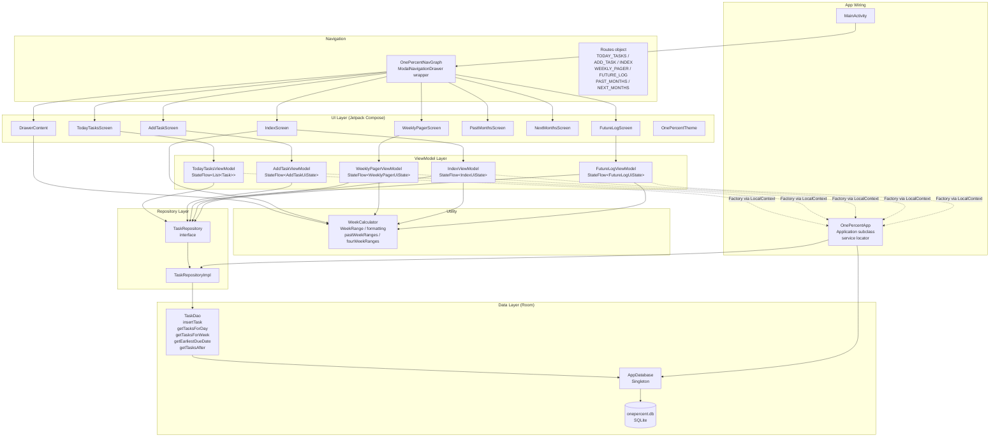

# Architecture Diagram

Overall layered architecture of the OnePercent app.

```mermaid
graph TD
    subgraph UI["UI Layer (Jetpack Compose)"]
        TTS[TodayTasksScreen]
        ATS[AddTaskScreen]
        IS[IndexScreen]
        WPS[WeeklyPagerScreen]
        FLS[FutureLogScreen]
        PMS[PastMonthsScreen]
        NMS[NextMonthsScreen]
        DC[DrawerContent]
        Theme[OnePercentTheme]
    end

    subgraph NAV["Navigation"]
        NG[OnePercentNavGraph\nModalNavigationDrawer wrapper]
        Routes[Routes object\nTODAY_TASKS / ADD_TASK / INDEX\nWEEKLY_PAGER / FUTURE_LOG\nPAST_MONTHS / NEXT_MONTHS]
    end

    subgraph VM["ViewModel Layer"]
        TTVM[TodayTasksViewModel\nStateFlow&lt;List&lt;Task&gt;&gt;]
        ATVM[AddTaskViewModel\nStateFlow&lt;AddTaskUiState&gt;]
        WPVM[WeeklyPagerViewModel\nStateFlow&lt;WeeklyPagerUiState&gt;]
        IVM[IndexViewModel\nStateFlow&lt;IndexUiState&gt;]
        FLVM[FutureLogViewModel\nStateFlow&lt;FutureLogUiState&gt;]
    end

    subgraph UTIL["Utility"]
        WC[WeekCalculator\nWeekRange / formatting\npastWeekRanges / fourWeekRanges]
    end

    subgraph REPO["Repository Layer"]
        TR[TaskRepository\ninterface]
        TRI[TaskRepositoryImpl]
    end

    subgraph DATA["Data Layer (Room)"]
        DAO[TaskDao\ninsertTask\ngetTasksForDay\ngetTasksForWeek\ngetEarliestDueDate\ngetTasksAfter]
        DB[AppDatabase\nSingleton]
        SQLITE[(onepercent.db\nSQLite)]
    end

    subgraph APP["App Wiring"]
        OPA[OnePercentApp\nApplication subclass\nservice locator]
        MA[MainActivity]
    end

    MA --> NG
    NG --> DC
    NG --> TTS
    NG --> ATS
    NG --> IS
    NG --> WPS
    NG --> FLS
    NG --> PMS
    NG --> NMS
    DC --> WC
    IS --> IVM
    IS --> WC
    WPS --> WPVM
    TTS --> TTVM
    ATS --> ATVM
    FLS --> FLVM
    TTVM --> TR
    ATVM --> TR
    WPVM --> TR
    IVM --> TR
    FLVM --> TR
    WPVM --> WC
    IVM --> WC
    FLVM --> WC
    TR --> TRI
    TRI --> DAO
    DAO --> DB
    DB --> SQLITE
    OPA --> DB
    OPA --> TRI
    TTVM -.->|Factory via LocalContext| OPA
    ATVM -.->|Factory via LocalContext| OPA
    WPVM -.->|Factory via LocalContext| OPA
    IVM -.->|Factory via LocalContext| OPA
    FLVM -.->|Factory via LocalContext| OPA
```
