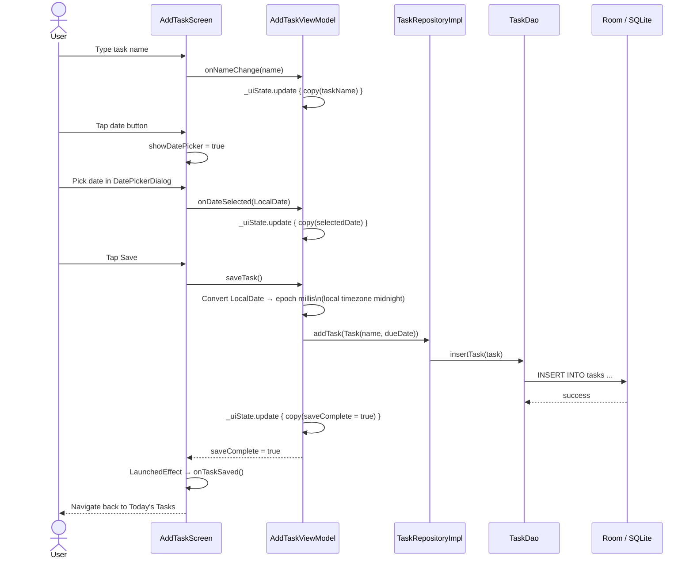
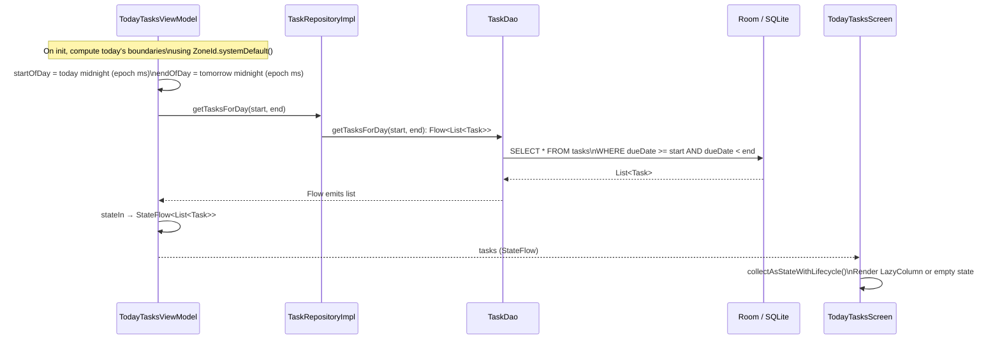
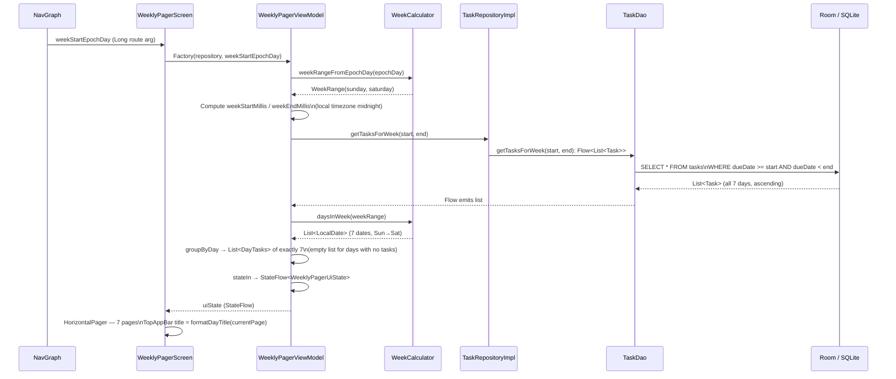

# Data Flow Diagrams

## Adding a Task

```mermaid
sequenceDiagram
    actor User
    participant Screen as AddTaskScreen
    participant VM as AddTaskViewModel
    participant Repo as TaskRepositoryImpl
    participant DAO as TaskDao
    participant DB as Room / SQLite

    User->>Screen: Type task name
    Screen->>VM: onNameChange(name)
    VM->>VM: _uiState.update { copy(taskName) }

    User->>Screen: Tap date button
    Screen->>Screen: showDatePicker = true
    User->>Screen: Pick date in DatePickerDialog
    Screen->>VM: onDateSelected(LocalDate)
    VM->>VM: _uiState.update { copy(selectedDate) }

    User->>Screen: Tap Save
    Screen->>VM: saveTask()
    VM->>VM: Convert LocalDate → epoch millis\n(local timezone midnight)
    VM->>Repo: addTask(Task(name, dueDate))
    Repo->>DAO: insertTask(task)
    DAO->>DB: INSERT INTO tasks ...
    DB-->>DAO: success
    VM->>VM: _uiState.update { copy(saveComplete = true) }
    VM-->>Screen: saveComplete = true
    Screen->>Screen: LaunchedEffect → onTaskSaved()
    Screen-->>User: Navigate back to Today's Tasks
```

## Loading Today's Tasks

```mermaid
sequenceDiagram
    participant VM as TodayTasksViewModel
    participant Repo as TaskRepositoryImpl
    participant DAO as TaskDao
    participant DB as Room / SQLite
    participant Screen as TodayTasksScreen

    Note over VM: On init, compute today's boundaries\nusing ZoneId.systemDefault()
    VM->>VM: startOfDay = today midnight (epoch ms)\nendOfDay = tomorrow midnight (epoch ms)
    VM->>Repo: getTasksForDay(start, end)
    Repo->>DAO: getTasksForDay(start, end): Flow<List<Task>>
    DAO->>DB: SELECT * FROM tasks\nWHERE dueDate >= start AND dueDate < end
    DB-->>DAO: List<Task>
    DAO-->>VM: Flow emits list
    VM->>VM: stateIn → StateFlow<List<Task>>
    VM-->>Screen: tasks (StateFlow)
    Screen->>Screen: collectAsStateWithLifecycle()\nRender LazyColumn or empty state
```

## Loading a Week's Tasks (WeeklyPagerScreen)

```mermaid
sequenceDiagram
    participant Nav as NavGraph
    participant Screen as WeeklyPagerScreen
    participant VM as WeeklyPagerViewModel
    participant WC as WeekCalculator
    participant Repo as TaskRepositoryImpl
    participant DAO as TaskDao
    participant DB as Room / SQLite

    Nav->>Screen: weekStartEpochDay (Long route arg)
    Screen->>VM: Factory(repository, weekStartEpochDay)
    VM->>WC: weekRangeFromEpochDay(epochDay)
    WC-->>VM: WeekRange(sunday, saturday)
    VM->>VM: Compute weekStartMillis / weekEndMillis\n(local timezone midnight)
    VM->>Repo: getTasksForWeek(start, end)
    Repo->>DAO: getTasksForWeek(start, end): Flow<List<Task>>
    DAO->>DB: SELECT * FROM tasks\nWHERE dueDate >= start AND dueDate < end
    DB-->>DAO: List<Task> (all 7 days, ascending)
    DAO-->>VM: Flow emits list
    VM->>WC: daysInWeek(weekRange)
    WC-->>VM: List<LocalDate> (7 dates, Sun→Sat)
    VM->>VM: groupByDay → List<DayTasks> of exactly 7\n(empty list for days with no tasks)
    VM->>VM: stateIn → StateFlow<WeeklyPagerUiState>
    VM-->>Screen: uiState (StateFlow)
    Screen->>Screen: HorizontalPager — 7 pages\nTopAppBar title = formatDayTitle(currentPage)
```
