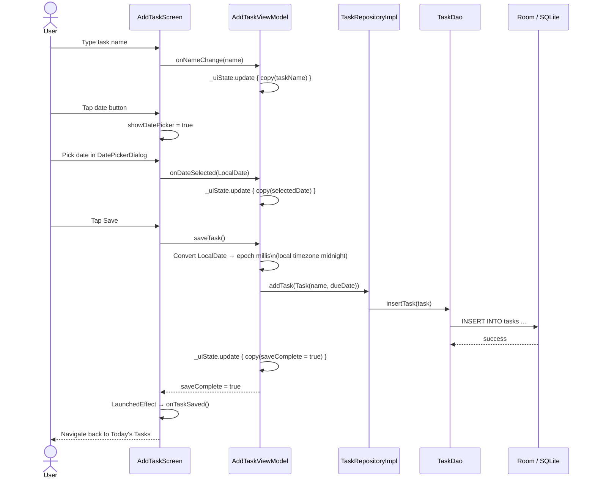
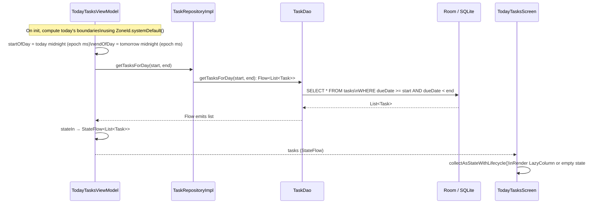
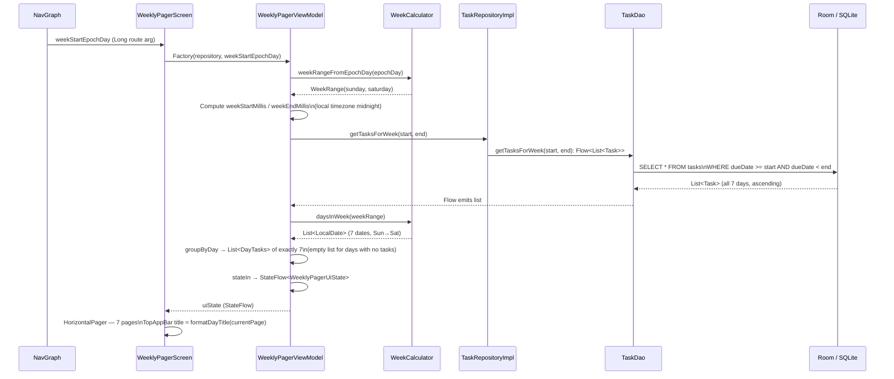
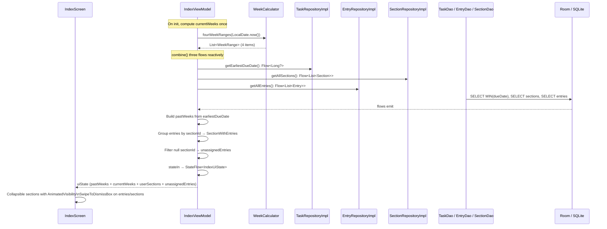
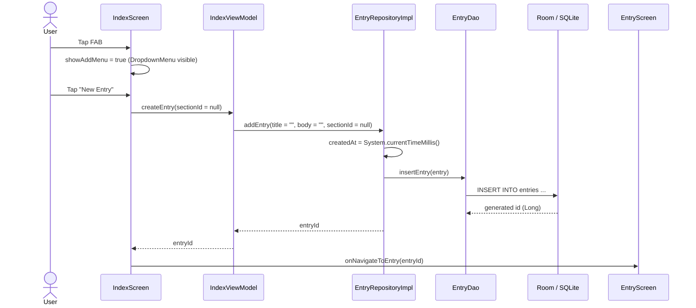
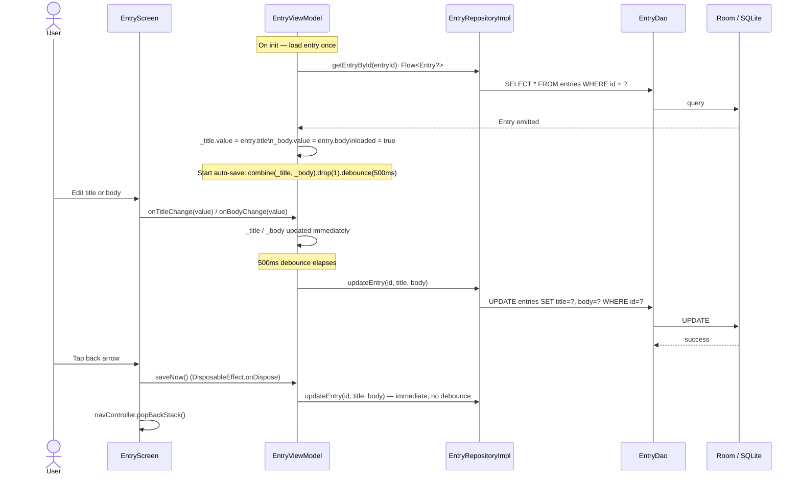
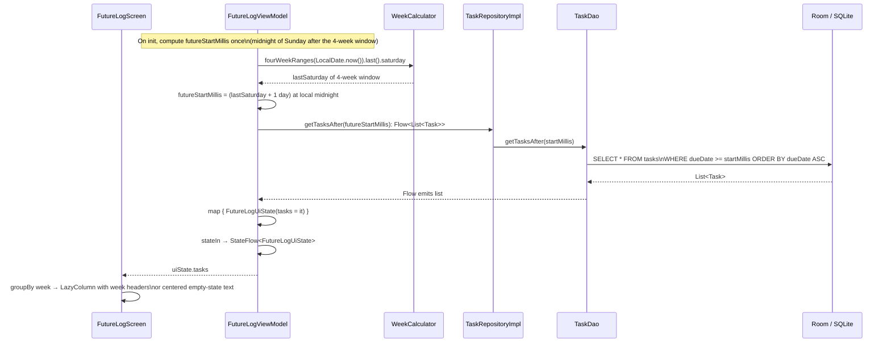

# Data Flow Diagrams

## Adding a Task

## Loading Today's Tasks

## Loading a Week's Tasks (WeeklyPagerScreen)

## Loading the Index Screen (IndexScreen)

## Creating an Entry

## Editing an Entry (auto-save)

## Loading the Future Log (FutureLogScreen)

