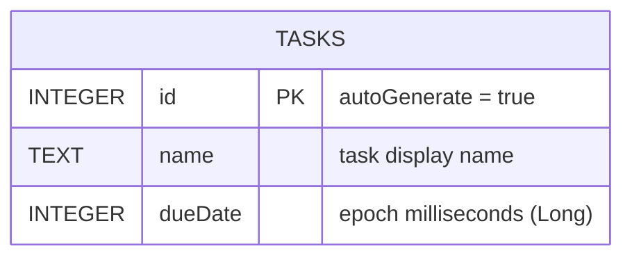

# Database Schema

Room database: `onepercent.db` — version 1

## Notes

- `dueDate` is stored as epoch milliseconds (Long / INTEGER in SQLite).
- The value represents **local-timezone midnight** of the chosen date, computed in `AddTaskViewModel.saveTask()` via `LocalDate.atStartOfDay(ZoneId.systemDefault())`.
- Queries use a `[startOfDayMillis, endOfDayMillis)` range to match tasks to a calendar day, avoiding timezone drift issues.
- When adding new entities, increment `@Database(version = N)` in `AppDatabase.kt` and provide a `Migration`.
