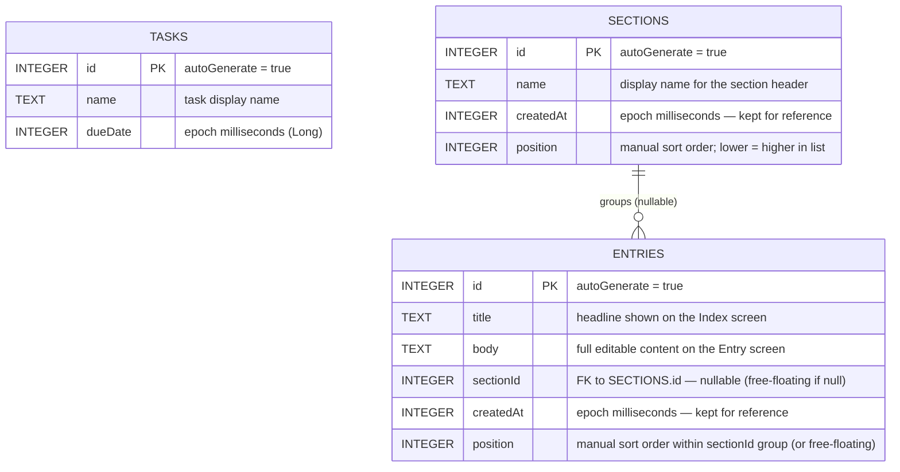

# Database Schema

Room database: `onepercent.db` — version 3

## Migration History

| Version | Change |
|---------|--------|
| v1 | `tasks` table |
| v2 | `sections` and `entries` tables added (`Migration(1, 2)` in `AppDatabase.kt`) |
| v3 | `position INTEGER NOT NULL DEFAULT 0` added to both tables; backfilled from `createdAt` order (`Migration(2, 3)` in `AppDatabase.kt`) |

## Notes

- `dueDate` is stored as epoch milliseconds (Long / INTEGER in SQLite).
- The value represents **local-timezone midnight** of the chosen date, computed in `AddTaskViewModel.saveTask()` via `LocalDate.atStartOfDay(ZoneId.systemDefault())`.
- Queries use a `[startOfDayMillis, endOfDayMillis)` range to match tasks to a calendar day, avoiding timezone drift issues.
- `ENTRIES.sectionId` is nullable — no Room `ForeignKey` constraint is used. Cascade (SET NULL on section delete) is handled in `SectionRepositoryImpl.deleteSection()` as a two-step transaction.
- `createdAt` is set to `System.currentTimeMillis()` in the repository layer on insert.
