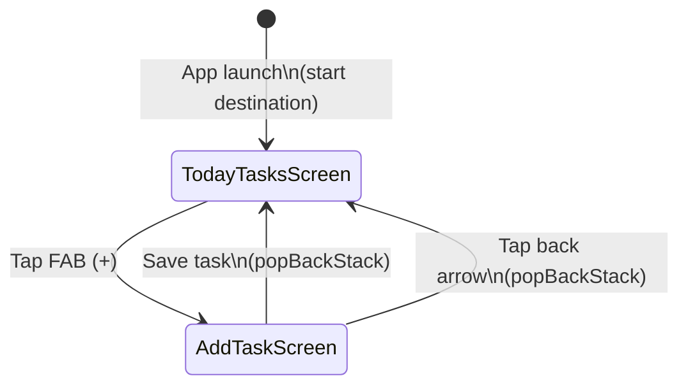
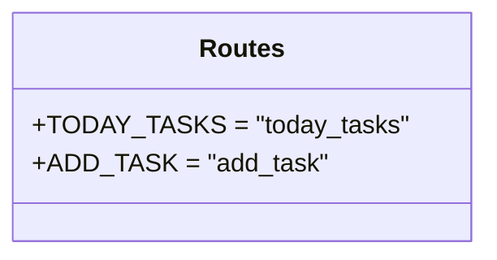

# Navigation Flow Diagram

Screen navigation graph for the OnePercent app.

```mermaid
stateDiagram-v2
    [*] --> TodayTasksScreen : App launch\n(start destination)

    TodayTasksScreen --> AddTaskScreen : Tap FAB (+)
    AddTaskScreen --> TodayTasksScreen : Save task\n(popBackStack)
    AddTaskScreen --> TodayTasksScreen : Tap back arrow\n(popBackStack)
```

## Route Constants

```mermaid
classDiagram
    class Routes {
        +TODAY_TASKS = "today_tasks"
        +ADD_TASK = "add_task"
    }
```
