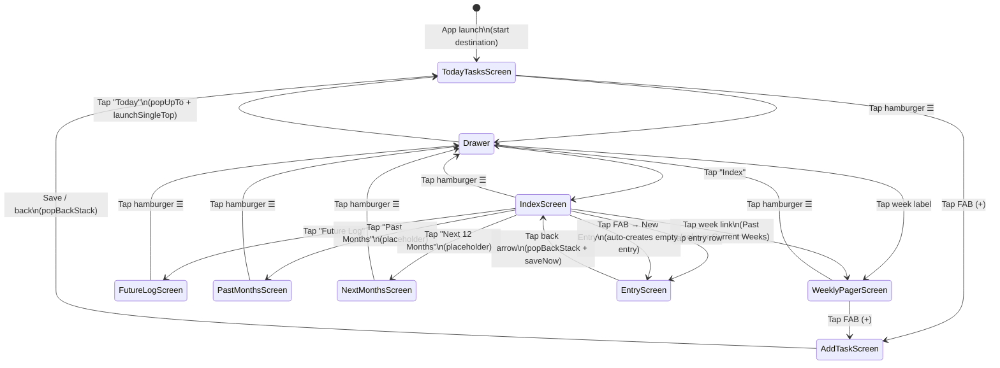

# Navigation Flow Diagram

Screen navigation graph for the OnePercent app.



## Notes
- `ModalNavigationDrawer` wraps the entire `NavHost` in `OnePercentNavGraph`
- `DrawerState` and `CoroutineScope` are hoisted in `NavGraph.kt`; screens receive `onOpenDrawer: () -> Unit` lambdas
- `AddTaskScreen` has no drawer access (modal form)
- `PastMonthsScreen` and `NextMonthsScreen` are stubs ("Coming soon") — no ViewModels needed

## Route Constants

```mermaid
classDiagram
    class Routes {
        +TODAY_TASKS = "today_tasks"
        +ADD_TASK = "add_task"
        +INDEX = "index"
        +WEEKLY_PAGER = "week/{weekStartEpochDay}"
        +FUTURE_LOG = "future_log"
        +PAST_MONTHS = "past_months"
        +NEXT_MONTHS = "next_months"
        +ENTRY = "entry/{entryId}"
        +weeklyPager(epochDay Long) String
        +entry(entryId Long) String
    }
```

## Weekly Pager
- Route argument `weekStartEpochDay` = `LocalDate.toEpochDay()` of the week's Sunday
- Pager has 7 pages (index 0 = Sunday → index 6 = Saturday)
- TopAppBar title updates dynamically as the user swipes

## Index Screen Sections
- **Past Weeks** — collapsed by default; hidden when no tasks exist before the current window
- **Current Weeks** — expanded by default; always shows 4 week links
- **Future Log** — single non-collapsible link
- **Monthly Logs** — collapsed by default; contains Past Months and Next 12 Months stubs
- **User Sections** — collapsible; each shows its entries; swipe-left on section deletes it (entries become free-floating)
- **Free-floating Entries** — listed below user sections; swipe-left deletes; tap navigates to EntryScreen

## EntryScreen
- Accessed from IndexScreen (existing entries) or auto-created via FAB → "New Entry"
- Route arg: `entryId: Long`
- No drawer access; back arrow returns to previous screen
- Auto-saves on change (500ms debounce); `saveNow()` called on `DisposableEffect.onDispose` as safety net
