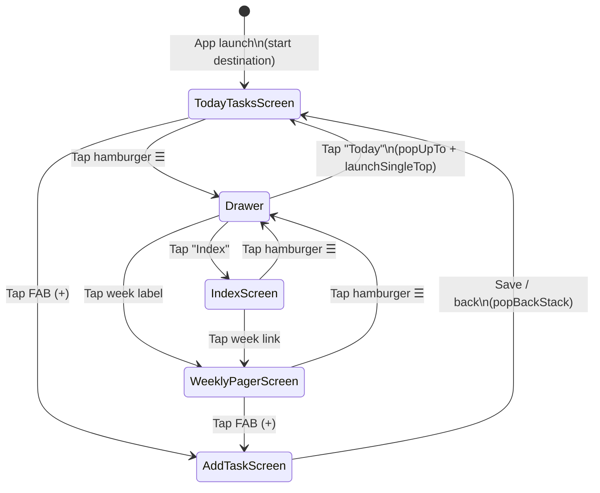

# Navigation Flow Diagram

Screen navigation graph for the OnePercent app.



## Notes
- `ModalNavigationDrawer` wraps the entire `NavHost` in `OnePercentNavGraph`
- `DrawerState` and `CoroutineScope` are hoisted in `NavGraph.kt`; screens receive `onOpenDrawer: () -> Unit` lambdas
- `AddTaskScreen` has no drawer access (modal form)

## Route Constants

```mermaid
classDiagram
    class Routes {
        +TODAY_TASKS = "today_tasks"
        +ADD_TASK = "add_task"
        +INDEX = "index"
        +WEEKLY_PAGER = "week/{weekStartEpochDay}"
        +weeklyPager(epochDay Long) String
    }
```

## Weekly Pager
- Route argument `weekStartEpochDay` = `LocalDate.toEpochDay()` of the week's Sunday
- Pager has 7 pages (index 0 = Sunday → index 6 = Saturday)
- TopAppBar title updates dynamically as the user swipes
